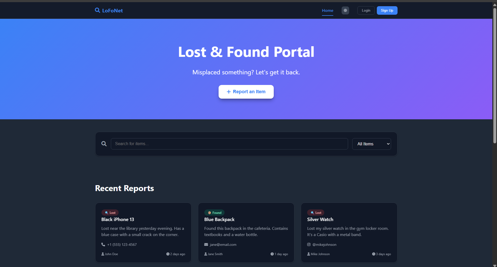
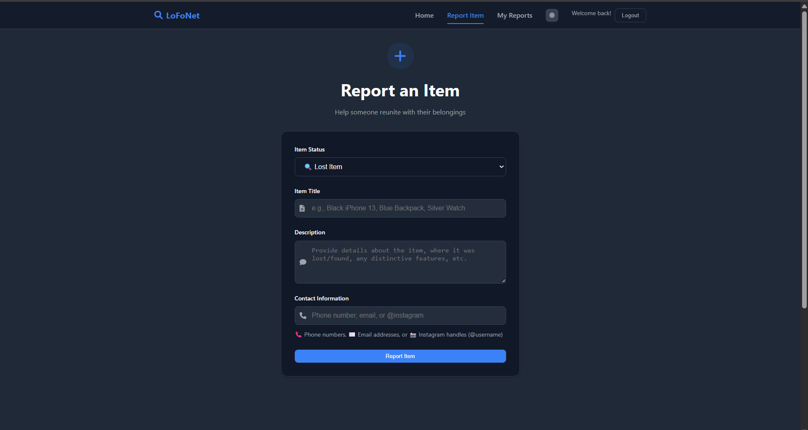
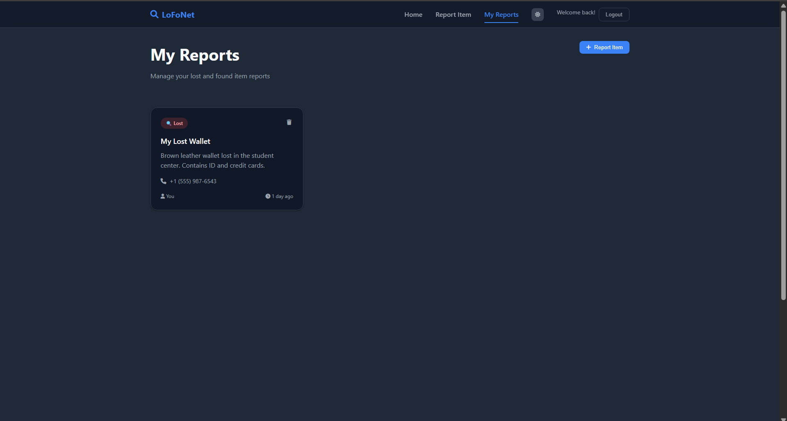
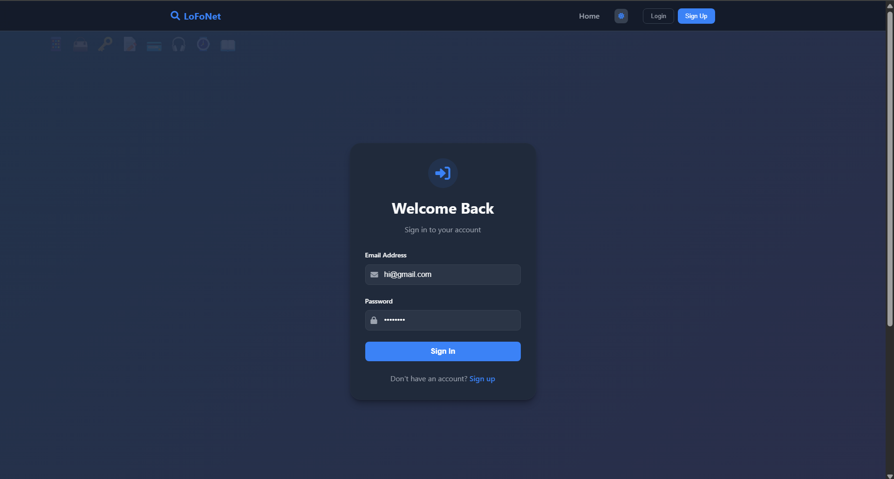

# 🧭 LoFoNet – Lost & Found Network

LoFoNet is a community-driven Lost & Found web application that allows users to report and search for lost or found items. The platform aims to help reconnect people with their belongings through a clean interface, real-time updates, and easy reporting.

---

## ✨ Features

- 🔐 User Authentication with Firebase (Sign Up / Login)
- 📝 Report Lost or Found items with item details and contact info
- 🔍 Search & filter items by type and title
- 🧾 View and manage personal reports with delete option
- 🎨 Light and dark theme toggle
- 🎊 Animated emojis and confetti (for visual delight)
- 📱 Mobile responsive design
- 📤 One-click share button using Web Share API
- 📬 Smart contact formatting (phone, email, Instagram)
- 🧠 Context API for global auth and theme state

---

## 📸 Screenshots

### 🏠 Home Page

### ➕ Add Item

### 📋 My Reports

### 🔐 Login Page

---

## 🛠️ Tech Stack Used

### 📦 Frontend
-Runtime Environment: React 18, TypeScript 5 (Strict Mode)
-State Management: React Context API + Custom Hooks
-Styling Engine: Tailwind CSS (Utility-First) + Shadcn UI (Component Primitives)
-Build Pipeline: Vite (ESBuild)
-Persistence Layer: PostgreSQL (Neon Serverless)
-Object Storage: ImgBB API (CDN Distribution)

### 🔧 Backend & Hosting
-Node.js Runtime: v18.x or higher
=Package Manager: NPM v9.x or higher
=Database: PostgreSQL connection string (Neon.tech recommended)

