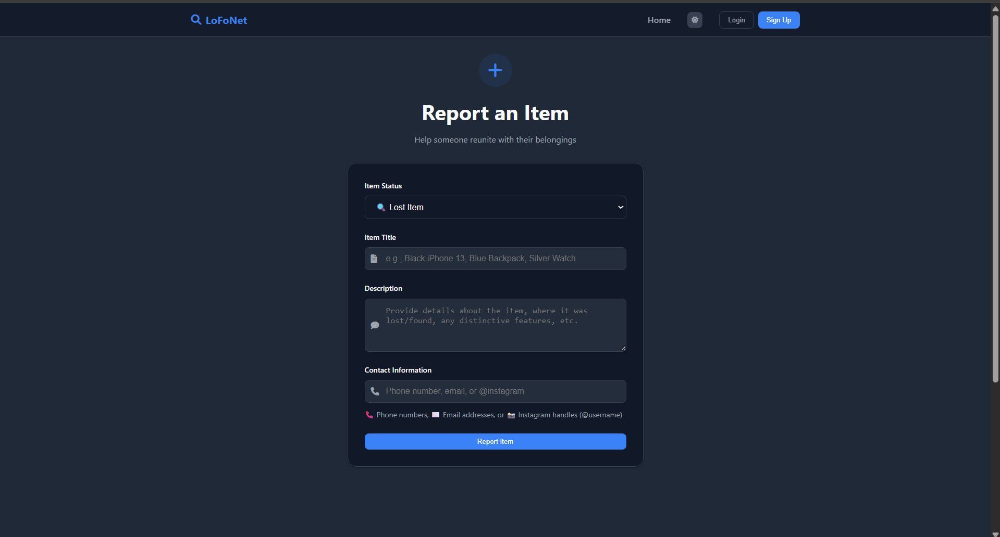

# 🧭 LoFoNet – Lost & Found Portal

LoFoNet is a community-driven Lost & Found web application that allows users to report and search for lost or found items. The platform aims to help reconnect people with their belongings through a clean interface, real-time updates, and easy reporting.

---

## ✨ Features

- 🔐 User Authentication with Firebase (Sign Up / Login)
- 📝 Report Lost or Found items with item details and contact info
- 🔍 Search & filter items by type and title
- 🧾 View and manage personal reports with delete option
- 🎨 Light and dark theme toggle
- 🎊 Animated emojis and confetti (for visual delight)
- 📱 Mobile responsive design
- 📤 One-click share button using Web Share API
- 📬 Smart contact formatting (phone, email, Instagram)
- 🧠 Context API for global auth and theme state

---

## 📸 Screenshots

> *(Make sure you place actual image files in a `/screenshots` folder)*

### 🏠 Home Page

### ➕ Add Item

### 📋 My Reports

### 🔐 Login Page

---

## 🛠️ Tech Stack Used

### 📦 Frontend
- React
- React Router DOM
- React Icons
- React Toastify
- React TSParticles

### 🔧 Backend & Hosting
- Firebase Authentication
- Firebase Firestore
- (Optional) Netlify / Vercel for Deployment

